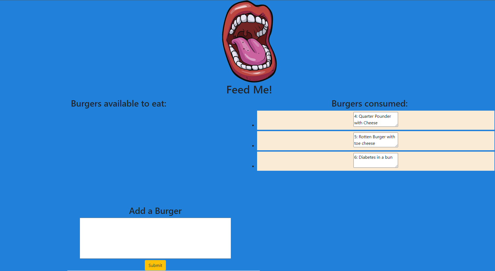

# Hamburger
Have you ever wanted to manage a local MySQL database of Burgers? Probably not.
This application fulfills dreams you never thought existed!

# instructions
1. Run the command "node server.js"
2. In the console open "localhost" (Ctrl+leftClick), or in the browser search "localhost:8080".
3. Enter the name of any burger in the "Add a burger box".
4. In the "Burgers available to eat box" click "eat" to eat the burger.
5. Then, observe the sad amount of burgers you've consumed in the "Burgers consumed tab".

